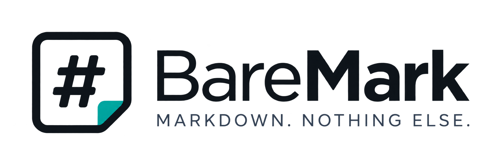

<p align="center">
  
</p>

<p align="center">
  <a href="#"></a>
  <a href="#"></a>
  <a href="#"></a>
  <a href="#"></a>
  <a href="#"></a>
  <a href="LICENSE"></a>
</p>

<p align="center">
  Fast, lightweight native Markdown viewer & editor for Windows.
</p>

> [!IMPORTANT]
> BareMark is currently under active development and is not ready for production use yet.

**Markdown. Nothing else.**

## Development status

Stages 0 and 1 are complete. BareMark now has a native Win32 window and lifecycle, a DPI-aware DIB backbuffer, independent semantic light/dark palettes, and an in-memory theme test button. The large taskbar/Alt+Tab icon remains stable while the small caption icon follows the actual title-bar contrast. Document viewing and editing are not implemented yet; stage 2 has not started. Windows 10 receives a best-effort immersive title-bar request with a safe native fallback when DWM rejects it.

## Requirements

- Go 1.22 or newer;
- PowerShell 7 on Windows, or GNU Make on Linux/WSL;
- network access on the first build to download the pinned build-time Windows resource generator.

The released application will not require Go or any other external runtime.

## Build

On Windows:

```powershell
.\build.ps1
.\build.ps1 -Architecture amd64 -Configuration debug
.\build.ps1 -Vulncheck
```

On Linux or WSL:

```bash
make
make debug
make vulncheck
```

Every canonical build first runs `go test ./...`, `go vet -unsafeptr=false ./...`, and the Windows-target vet check with the same vet flag. A failed check stops the build before an executable is produced. The optional PowerShell `-Vulncheck` switch runs `govulncheck ./...` before building; run it before a release. Install the scanner with `go install golang.org/x/vuln/cmd/govulncheck@latest` if needed.

Build artifacts are written to `dist/`:

```text
baremark-{version}-amd64.exe
baremark-{version}-arm64.exe
```

The version is read from `version.go`. BareMark's build-time resource generator assigns stable PE icon group IDs: `1` for the primary dark Shell icon, `101` for the light application icon, `201` and `202` for light and dark file icons, and `32512` for the dark `IDI_APPLICATION` icon. Both architectures and build configurations use the same mapping. Mandatory assets are validated before every canonical build; the generated EXE is checked against all four canonical ICO files, the manifest, and version information before publication.

Executables are built and validated under temporary names in `dist/`. A stable artifact name is replaced only after the temporary executable passes every build check, so a failed build leaves the previously published executable unchanged.
